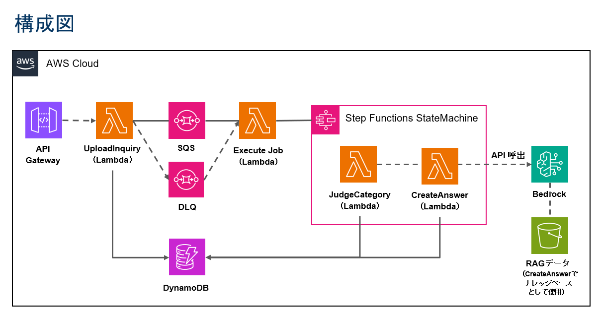

# AWS Lambda／Step Functions ハンズオン

## 全体の流れ

### システム構成
- **UploadInquiry Lambda** → ユーザーの問い合わせを受け取り、DynamoDBに保存し、SQSにidを送信
- **SQSキュー** → UploadInquiryから送られてきたidを保持
- **Execution Lambda** → SQSメッセージからidを取り出し、Step Functionsステートマシンを起動
- **Step Functions** 
  - Task1: JudgeCategory Lambdaを呼ぶ
  - Choice: カテゴリに応じて分岐
  - Task2: CreateAnswer Lambdaを呼ぶ（RAG機能あり）
- **DynamoDB** → 問い合わせ、カテゴリ、回答データを保持

### データフロー
詳細なデータ受け渡しについては `dataflow.md` を参照してください。

## 構築手順

### 1. 事前準備
-  Bedrock基盤モデルアクセス有効化
-  IAM基本ロール作成（Lambda用、Step Functions用）

### 2. 基盤リソース作成
-  DynamoDB テーブル作成
-  SQS キュー作成（デッドレターキュー含む）

### 3. Lambda関数作成・テスト
-  JudgeCategory Lambda作成・デプロイ
-  CreateAnswer Lambda作成・デプロイ
-  個別Lambda関数テスト（Bedrock呼び出し確認）

### 4. ワークフロー構築
-  Step Functions ステートマシン作成
-  ExecuteJob Lambda作成・デプロイ
-  UploadInquiry Lambda修正・デプロイ

### 5. 統合設定
-  SQS → ExecuteJob トリガー設定
-  各Lambda関数の環境変数設定
-  IAMロールの詳細権限追加

### 6. テスト・検証
-  Step Functions実行テスト
-  統合テスト

### 7. オプション機能（後から追加可能）
-  S3バケット作成・データアップロード（RAG用）
-  Bedrock Knowledge Base作成
-  CreateAnswer関数の環境変数にKnowledge Base ID設定

## 環境変数の設定

### UploadInquiry
| 変数名 | 必須 | 説明 |
|--------|------|------|
| `TABLE_NAME` | 〇 | DynamoDBテーブル名 |
| `SQS_QUEUE_URL` | 〇 | SQSキューURL |

### ExecuteJob
| 変数名 | 必須 | 説明 |
|--------|------|------|
| `STATE_MACHINE_ARN` | 〇 | Step Function ステートマシーンのARN |

### JudgeCategory
| 変数名 | 必須 | デフォルト値 | 説明 |
|--------|------|-------------|------|
| `TABLE_NAME` | 〇 | - | DynamoDBテーブル名 |
| `BEDROCK_MODEL_ID` | - | anthropic.claude-3-sonnet-20240229-v1:0 | Bedrockモデル ID |

### CreateAnswer
| 変数名 | 必須 | デフォルト値 | 説明 |
|--------|------|-------------|------|
| `TABLE_NAME` | 〇 | - | DynamoDBテーブル名 |
| `BEDROCK_MODEL_ID` | - | anthropic.claude-3-sonnet-20240229-v1:0 | Bedrockモデル ID |
| `KNOWLEDGE_BASE_ID` | - | - | RAG用ナレッジベースID |

## IAM権限の設定

### UploadInquiry
- **DynamoDB**
  - `dynamodb:PutItem` （該当テーブルARN）
- **SQS**
  - `sqs:SendMessage` （該当キューARN）
- **CloudWatch Logs**
  - `logs:CreateLogStream`
  - `logs:PutLogEvents`

### ExecuteJob
- **Step Functions**
  - `states:StartExecution`
- **SQS**
  - `sqs:ReceiveMessage`
  - `sqs:DeleteMessage`
  - `sqs:GetQueueAttributes`
- **CloudWatch Logs** (自動付与)

### Step Functions State Machine
- **Lambda**
  - `lambda:InvokeFunction`
- **CloudWatch Logs**
  - `logs:CreateLogGroup`
  - `logs:CreateLogStream`
  - `logs:PutLogEvents`

### JudgeCategory
- **DynamoDB**
  - `dynamodb:GetItem` （該当テーブルARNに対して）
  - `dynamodb:UpdateItem` （該当テーブルARNに対して）
- **Bedrock**
  - `bedrock:InvokeModel`
- **CloudWatch Logs**
  - `logs:CreateLogGroup`
  - `logs:CreateLogStream`
  - `logs:PutLogEvents`

### CreateAnswer
- **DynamoDB**
  - `dynamodb:GetItem` （該当テーブルARNに対して）
  - `dynamodb:UpdateItem` （該当テーブルARNに対して）
- **Bedrock**
  - `bedrock:InvokeModel`
  - `bedrock:Retrieve`
- **CloudWatch Logs**
  - `logs:CreateLogGroup`
  - `logs:CreateLogStream`
  - `logs:PutLogEvents`
